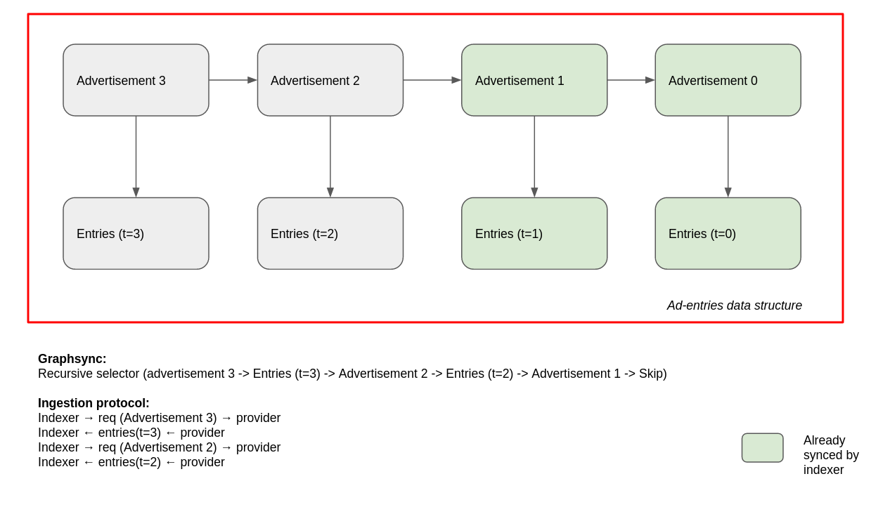

# Indexer Reference Provider Design
The goal of this reference implementation is to flesh out all the protocol details
for data providers to be able to interact with indexer nodes. 

## Overview
- Data providers keep a local index with a list of CIDs of all the content they are providing.
- Data providers are responsible for the advertisement of updates related to the data they are providing.
        - Data providers must be able to uniquely identify the batches of data they are providing, and/or the
        advertisements they broadcast to the network in order to be able to serve indexer-node data ingestion requests.
- Indexer nodes listen to advertisement from data providers. When they come across a previously unseeend
advertisement for a data provider, they trigger a new ingestion session to sync with the provider. 

## Data Structures
Data providers and indexer nodes can use any internal representation they want for indexed data. The only
data structures enforced by the protocol are in the interaction between the two.

### Advertisements
Advertisements are used by data providers to share updates about the data they are providing. Ideally,
these advertisements are published in a shared pub-sub channel between providers and indexer nodes. However,
some indexer nodes may choose to provide a dedicated endpoint to allow certain authenticated providers to push advertisements and updates to individual CID index values (or small sets of them).
- `Poll` Advertisements: Indexer-nodes periodically poll known providers for new advertisements.
- `Subscription` Advertisements: Indexer nodes subscribe to a shared pub-sub channel with providers and listen to new advertisements from them. Indexers can use
these advertisements also to discover new providers to index.
- `Push` Advertisements: Authenticated providers can push advertisements to indexer-nodes. Push Advertisements can also be used by indexers for the
discovery of new providers. Providers looking to be considered and validated by an indexer can send a push advertisements proactively. 

```go
// AdvertisementID uniquely identifies an advertisement.
// It is the multihash of IndexID + Provider + Previous.
type AdvertisementID mh.Multihash

type Advertisement struct {
        ID              AdvertisementID
        IndexID         cid.Cid
        Previous        AdvertisementID
        Provider        peer.ID
        Signature       []byte
        GraphSupport    bool
        
}
```
- `ID` is the unique identifier used by the data provider to identify this update.
- `IndexID` is the CID of the data included in the Advertisement. It can be used by the indexer to authenticate the
advertisement and the data ingested from the provider.
- `Previous` links the current advertisement for the provider with the previous one. This allows
providers to track the advertisements they are broadcasting, and 
indexer nodes to realize when they have missed a previous advertisement.
- `Provider` determines the source of the advertisement.
- `Signature` is a signature over `Advertisement.ID` to authenticate that the advertisement has been generated by `Provider`.
- `GraphSupport` is used by providers to signal indexer nodes that they support IPLD-aware ingestion sessions (see [protocol](#protocol)).

Indexer nodes use these IDs in their ingestion requests to fetch indexing
data from the provider.

For instance, a Filecoin miner may reference from a new `Advertisement` the set of CIDs included in a new deal, and it may
represent the internal state for this CID and its link to the advertisement however it wants. However, `IndexID` should represent the CID of all the entries
the advertisement is referencing
to allow the indexer node to authenticate that the data ingested belongs to the requested advertisement.

Indexer nodes are able to configure the list of advertisement policies they support.

<!--
A Filecoin miner may choose to use as `AdvertisementID` a combination of a `dealID` with a prefix to identify if
the advertisement points to a new deal or the expiration of a deal. Thus, when a miner receives an ingestion
request for `AdvertisementID` from an indexer node, it can easily build the ingestion response (either with the
batch of new CIDs provided in the deal, or with the list of CIDs the indexer should stop providing due to a deal expiration). Other data providers may choose to generate their `AdvertisementID`s in alternative ways.

For indexer nodes, `AdvertisementID` is an opaque `String` and has no additional significance apart from the unique ID
for a data provider advertisement.
-->

### Ingestion Request
When an indexer node finds an unseen `Advertisement` and realizes that it is not in sync with a data provider, it sends
an ingestion request to the data provider to index/remove data.
```go
type IngestionRequest struct {
        ID              AdvertisementID
        Start           uint64
        Count           uint64
}
```
- `ID`: `AdvertisementID` for which data is being requested.
- `Start`: Starting entry from which data wants to be requested.
- `Count`: Maximum number of entries that wants to be received in the response.
....
### Ingestion Response
Data providers use `IngestionResponse`s to answer to ingestion requests.

```go
type IngestionResponse struct {
        Size            uint64
        Error           String  // optional
        Start           uint64  // optional
        Advertisement   Advertisement // optional
        Entries         []Entry
}
```
- `Size`: Total entries included for `AdvertisementID`.
- `Error`: Error message (if any).
- `Start`: Index of the first entry of the response.
- `Advertisement`: Advertisement to which this response (and thus indexing data) belongs to.
- `Entries`: The actual entries with the new/removed CIDs.


```go
type Entry struct {
        RmCids          []cid.Cid
        Cids            []cid.Cid   // NOTE: We can probably use String instead of cid.Cid
        Metadata        []byte

}
```
- `RmCids`: List of CIDs to remove from the indexer. 
- `Cids`: List of CIDs included in the entry.
- `Metadata`: Metadata to index for CIDs in the entry. If `len(RmCids) != 0 && len(Cids)== 0` it doesn't make sense to add `Metadata` in the Entry.

## Interfaces
### Data Provider
Interface implemented by data providers for the interaction with indexer nodes.

```go
type IngestionServer interface {
        
        // PublishLocal provides a new advertisement locally.
        // Indexers can access all advertisements published locally by
        // a data provider via polling.
        // Providers may choose where to store these advertisements 
        // (S3, datastore, etc.)
        func PublishLocal (ctx context.Context, ad Advertisement) error

        // Publish advertisement to indexer pubsub channel
        // Every advertisement published to the pubsub channel
        // is also provided locally.
        func Publish (ctx context.Context, ad Advertisement) error

        // PushAdv pushes a new advertisement to a specific indexer
        func PushAdv (ctx context.Context, indexer peer.ID, ad Advertisement) error

        // Push an update for a single entry.
        // This can be used to perform updates for a small number of CIDs
        // When a full advertisement is not worth it (web3.storage case).
        // Indexer may only accept pushes from authenticated providers.
        func Push (ctx context.Context, indexer peer.ID, entry Entry) 


}
```

Data providers need to include protocol handlers able to process and serve indexer node 
ingestion requests (see [protocol](#protocol)).

### Indexer Node
Interface implemented by indexer nodes for the interaction with data providers.

```go
type IngestionClient interface{
        // Ingest requests the ingestion of a specific range of updates
        func Ingest (ctx context.Context, p peer.ID, firstID AdvertisementID, lastID AdvertisementID) error

        // Sync with a data provider up to latest ID
        func Sync (ctx context.Context, p peer.ID, latest AdvertisementID) error

        // Subscribe to advertisements of a specific provider in the pubsub channel
        func Subscribe (ctx context.Context, p peer.ID) error

        // Poll requests new advertisement to providers
        func Poll (ctx context.Context, p peer.ID) error
}

```

Data providers need to include protocol handlers able to process and serve indexer node 
push Advertisements and immediate ingestions (see [protocol](#protocol)).

## Protocol
The interaction protocol between data providers and indexer nodes can be divided in two subprotocols: the advertisement protocol, and the ingestion protocol.

## Advertisement Protocol
It orchestrates the advertisement of udpates from data providers to indexer nodes. Every time a data provider receives
an update for the data they provide (e.g. new deal in a Filecoin miner), they may choose to broadcast an `Advertisement`
to the network so indexer nodes can start indexing this data. Three kinds of updates will initially be supported:
- `Subscription` Advertisements (`Publish()`/`Subscribe()`): Data providers broadcast the `Advertisement` for the new data using a shared
pub-sub channel. When indexer nodes see these updates, they trigger an ingestion session to sync with the
data provider. 
- `Poll` Advertisements (`PublishLocal()`/`Poll()`): Indexers can periodically poll providers requesting for new advertisements. This is useful if an indexer or a provider was offline and may have missed updates, or if an indexer chooses not to advertise updates. The indexer issues a request to the provider to get the latest advertisement. The provider responds with the latest advertisement, which the indexer handles the same as if they had been received over gossip.
- `Push` Advertisements (`PushAd()`): Some indexer nodes may support advertisement pushes by data providers. Indexers 
will trigger a new ingestion session to gather the data for that update. Pushes from previously unseen provideres may require a validation previous to ingestion.
- `Immediate` Ingestion (`Push()`): Some data providers may want to share updates for a small number of CIDs which don't
require the generation of a dedicated `Advertisement` and triggering an ingestion session. For this case, indexer
nodes will provide an endpoint for providers to push small updates directly to them. Indexer nodes may
restrict immediate ingestion updates to authenticated data providers __(we3.storage case)__.

## Ingestion Protocol
Indexer nodes track locally the latest `AdvertisementID` seen for each data provider. When an `Advertisement` for an unseen `AdvertisementID` is seen for a data provider, a new ingestion session is triggered with the data provider (`Ingest()` / `Sync()`).

Data providers are responsible for broadcasting `Advertisement`s and generating their `AdvertisementID`s in the way that
suits them best. This means that they may choose to use IPLD data structures under the hood to link their advertisements
with their indexed data, so that `AdvertisementID` is a link to the indexed data for that `Advertisement`. If this is
the case, the provider may set the `GraphSupport` flag in its `Advertisement` to signal indexer nodes that they
can use IPLD-aware data transfer protocol, such as Graphsync, for the ingestion session.

It is worth noting, that the same CID may appear in entries of several different advertisements of a provider. For instance,
if a Filecoin miner receives a new deal that includes a CID of some content it is already indexing, it may notify this update to the
indexer node by including an entry for that CID with new metadata (like the new expiration date of the deal) in the next advertisement.
When the indexer node comes across an advertisement including a CID that it is already indexing for the provider, it will simply update
the metadata with the one of the latest advertisements. Finally, if all the deals that include that CID in a miner expires,
it can notify this to the indexer by simply adding that CID in the list of `RmCids` for the next advertisement.

When an indexer node triggers a new `Sync` with provider `p`, for `latest AdvertisementID`:
- Indexer node checks the last `AdvertisementID` seen for `p`, `current`.
- It sends a request to ingest the data related with `latest` advertisement, `Sync(ctx, p, latest)`.

According to how the data providers choose to represent their indexed data locally, two flavors of the ingestion protocols can be instantiated by the indexer node.

### IPLD-aware Ingestion
Initially, this will be default transport. If a data provider is indexing data in a way that `AdvertisementID` is linked with the indexed data using IPLD, the `GraphSupport` flag is enabled in its Advertisements to signal indexer nodes that they can use IPLD-aware data transfer
protocols.

When an indexer node sees an unseen advertisement `latest`, it will trigger an ingestion session to sync with the
data provider. If `GraphSupport` is enabled, the indexer node can use Graphsync or `go-data-transfer` to fetch `latest` DAG, which links to the data that needs to be ingested, using a [`ExploreRecursiveEdge`](https://ipld.io/specs/selectors/) selector. `latest` will include a link to the data structure for the previous `AdvertisementID` to latest, so Graphsync is able to fetch all the chain of updates from the provider seamlessly up to the latest one seen by the indexer node.

In order not to sync the whole chain of advertisements in every request and exclusively fetching the missing range, 
the indexer node will have to be able to flag in the Graphsync request a "termination link",
i.e. the link from which Graphsync can stop traversing the chain and stop recursing links.

Once the sync process is finished, the indexer node updates the latest AdvertisementID seen for provider to `latest`.

```go
// Example of internal data structure of an index of data provider.
type AdvertisementID Index_Link

type Index struct {
        Previous: Index_Link{},
        Entries: []Entry{
                RmCids:         []cid.Cid, 
                Cids:           []cid.Cid,        // NOTE: This can also be string.
                Metadata:       []byte,
        },
} 
```

_NOTE: We need to build the selector or the IPLD storer in the indexer node so that it checks the latest Advertisement
seen and it terminates Graphsync's DAG traversal conveniently._

### IPLD-unaware Ingestion 
> Out of scope of MVP. For the MVP we are only considering IPLD-aware ingestion, and we enforce the use of IPLD to providers.

It implements a libp2p request-response ingestion protocol that indexer nodes can use when interacting with providers that are not indexing their
data using IPLD, i.e. `Advertisement`s are not directly linked to data. This protocol is inspired by 
[Filecoin's Block Sync protocol](https://spec.filecoin.io/#section-algorithms.block_sync). The underlaying idea is the same, to "sync a chain of data".

Thus, when calling `Sync(ctx, p, latest)`, indexer node sends a first request for ingestion as:
```go
req = IngestionRequest{
        ID: latest,
        Start: 0, 
}
```

Provider will answer with the list of entries for `latest` pointing to the previous `AdvertisementID` in the `Advertisement` field. `Size` specifies
the total number of entries that the advertisement include to give the indexer knowledge of when all entries for the update have been received.

```go
resp = IngestionResponse {
        Size: 2
        Error: 0
        Start: 0
        Advertisement: Advertisement{
                ID: latest,
                Previous: "latest-1",
                IndexID: Link_Index,
                Provider: p,
                Signature: []byte{},  // The original signature of the advertisement.
                GraphSupport: false, 
        }
        Entries: {
                []Entry{
                        Cids: {Cid1, Cid2, ...},
                        RmCids: {Cid3, Cid4, ...},
                        Metadata: []byte{},
                }
}
```


The response may be paginated either by the client requesting a maximum number of entries or by the server delivering up to a configured maximum number of entries.  To get the remaining entries, a subsequent request is made with its start set to the number of entries from the previous response.  So, if totalEntries equals 100 and the response contained 50 entries, the follow-up request should specify 50 for start to get the remaining entries.  This continues until the indexer has the complete response.

The indexer keeps a record of the advertised Index CIDs it has received data for.  The indexer continues walking the chain of Index CIDs backward from `latest` until it receives a response containing an `Advertisement` with the `Previous` CID being the last one the indexer has already seen, i.e. `current`, or when the end of the chain is reached (i.e. no `Previous`).  When all the missing links in the chain of Indexes have been received, these are applied, in order, to update the indexer's records of CIDs and providers.

Note that pagination is performed at an `Entry` level, i.e. there is no intra-Entry pagination (at least not initially). The data provider should be responsible for dividing single Entries with a large number of CIDs into
smaller entries when computing the `Size` of the data indexed in `AdvertisementID`. If we identify this as too strong
of a requirement, we can also introduce intra-Entry pagination to support seamless exchange of entries with a large
amount of CIDs.
<!--
If `Size > len(Entries)`, the indexer-node sends a new request to keep fetching data for `latest` with `Start: 1`
until all entries for the Advertisement have been received. It then inspects `Advertisement` to see if `Previous` is equal
to the latest `AdvertisementID` seen for that provider, if this is not the case, it sends a new request with `latest-1`
and repeats the process over and over again until the `AdvertisementID` seen in `Previous` for the latest response
equals the latest one seen by indexer node for that data provider and the full sync for the missing range is complete.
-->

Once all the data for an indexer has been fetched, the indexer can use the `Advertisement` and the list of entries received to authenticate the
ingestion by computing the Cid of the entries and verifying that it is equal to `IndexID`, and then verifying the signature
of the `Advertisement`. The CID is computed by serializing the content and computing the IPLD link (see [linkingSystem](https://github.com/ipld/go-ipld-prime/blob/master/linking.go))

If the full sync is performed successfully, the indexer node updates the latest `AdvertisementID` seen for `p` to `latest`. 

Indexer nodes run ingestion sessions for different providers in parallel, so an indexer node can sync with several provideres in parallel.


<!-- NOT POSSIBLE. WE NEED TO APPLY UPDATES IN ORDER
They can also set a `prov_parallel_ingestion` config to determine if it wants to support parallel ingestions for
the same provider. If `prov_parallel_ingestion = 0` new `Advertisement`s arriving for an indexer node while `syncing` are queued, and are processed after the sync for the provider is done. If `prov_parallel_ingestion > 0`, the indexer node
tracks `Sync` sessions, and new Advertisements trigger new ingestion sessions with the provider for a non-overlapping
range between the current syncs and the new one. Thus, if there is a ingestion session with `latest = ID1` and
a new advertisement arrives with `AdvertisementID: ID2` and `prov_parallel_ingestion > 0` then a new ingestion
session is started for the range `(ID1, ID2] with `Ingest(ctx, p, ID1, ID2)`.
-->

## Provider Snapshots
> Work in progress. Needs discussion. Do we need this?

- If advertisement chains become too large, a provider may choose to create a snapshot to
prune the chain and ease the syncing process of new indexers.
- A snapshot is a new advertisement that points to the current state of the provider's index
without `Previous`. Snapshots can also come pretty handy for indexers to check the consistency of
the data they keep.
- New advertisement after the snapshots start a new chain with the snapshot as genesis (i.e. the next
advertisement after the snapshot has the snapshot advertisement as `Previous`).

## Open Questions / Discussion / Future Work
- ...
- ...
